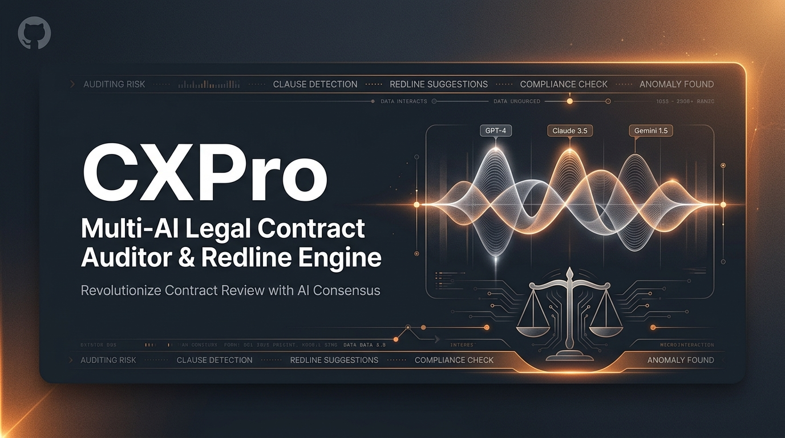
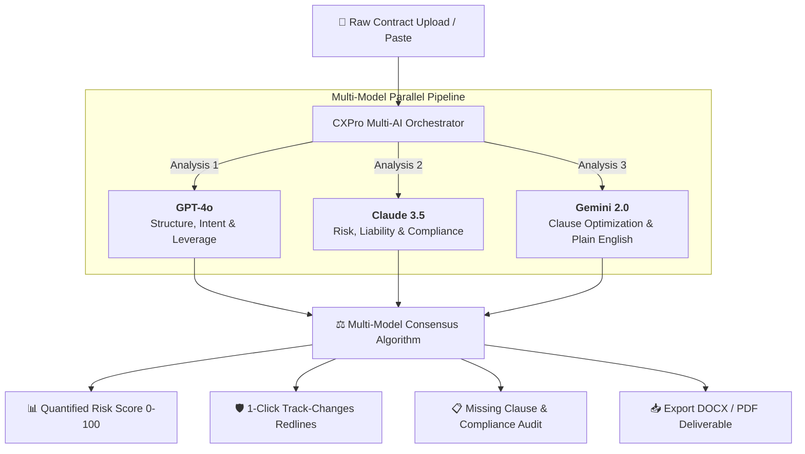

<div align="center">



# cxpro.site — Multi-AI Legal Contract Auditor & Redline Engine

### Autonomous Legal Engineering • 3-Model AI Consensus • Real-Time Risk Redlining • 500+ Benchmark Clauses

[](https://cxpro.site)
[](https://www.typescriptlang.org/)
[](https://react.dev/)
[](https://tailwindcss.com/)
[](https://ai.google.dev/)
[](https://render.com)
[](#)

<p align="center">
  <a href="#-key-features">Features</a> •
  <a href="#-multi-ai-architecture">Architecture</a> •
  <a href="#-tech-stack">Tech Stack</a> •
  <a href="#-quick-start">Quick Start</a> •
  <a href="#-pricing--tiers">Pricing</a> •
  <a href="#-deployment">Deployment</a> •
  <a href="#-security">Security</a>
</p>

---

</div>

## 🌟 Executive Overview

**cxpro.site** is an enterprise-grade AI legal engineering platform that orchestrates multiple frontier Large Language Models simultaneously (**GPT-4o**, **Claude 3.5 Sonnet**, and **Gemini 2.0**) to perform 360° vulnerability auditing, liability exposure analysis, and automated counter-proposal drafting in seconds.

Designed for legal teams, in-house counsel, and software/AI testing contractors on **Handshake AI**, cxpro.site eliminates hours of tedious contract review while guarding against catastrophic liability traps, indemnification imbalances, and non-compliant clauses.


---

## ⚡ Key Features

<table>
  <tr>
    <td width="50%">
      <h3>🤖 Multi-AI Consensus Risk Engine</h3>
      <ul>
        <li>Triangulates contract risk across 3 independent AI perspectives.</li>
        <li>Highlights <strong>Critical</strong>, <strong>High</strong>, <strong>Medium</strong>, and <strong>Low</strong> severity risks.</li>
        <li>Computes quantifiable financial exposure estimates & negotiation leverage balance.</li>
      </ul>
    </td>
    <td width="50%">
      <h3>📝 Interactive Redline & Counter-Proposal</h3>
      <ul>
        <li>Generates 1-click plain-English contract amendments.</li>
        <li>Side-by-side comparison of original text vs. recommended revisions.</li>
        <li>Instant <strong>Track-Changes DOCX</strong> and formatted PDF export.</li>
      </ul>
    </td>
  </tr>
  <tr>
    <td width="50%">
      <h3>📚 500+ Vetted Clause Library</h3>
      <ul>
        <li>Searchable database categorized by industry, jurisdiction, and risk profile.</li>
        <li>Multi-flavor clause variations: <em>Vendor-Favorable</em>, <em>Customer-Favorable</em>, and <em>Balanced</em>.</li>
        <li>1-click injection directly into active contract drafts.</li>
      </ul>
    </td>
    <td width="50%">
      <h3>🎓 Handshake AI & Contractor Shields</h3>
      <ul>
        <li>Exclusive 1099 QA & AI model tester discount program (<strong>$49.99/mo</strong>).</li>
        <li>Pre-built riders for <strong>AI Hallucination Liability Shields</strong>, <strong>Prompt IP Carve-Outs</strong>, and <strong>5-Day QA Acceptance</strong>.</li>
        <li>Instant automated student voucher verification & receipt dispatch.</li>
      </ul>
    </td>
  </tr>
  <tr>
    <td width="50%">
      <h3>⚡ Dynamic Contract Generator</h3>
      <ul>
        <li>Assemble legally enforceable NDAs, MSAs, SaaS Agreements, and SOWs from scratch.</li>
        <li>Custom field mapping and automated clause assembly.</li>
        <li>Instant deep-scan auditing of newly drafted contracts.</li>
      </ul>
    </td>
    <td width="50%">
      <h3>🏢 Enterprise White-Label Rebranding</h3>
      <ul>
        <li>Custom law firm branding, custom primary color theme, and custom PDF headers/footers.</li>
        <li>Multi-seat role-based access control and historical audit archive.</li>
        <li>Encrypted AES-256 in-memory data processing.</li>
      </ul>
    </td>
  </tr>
</table>

---

## 🧠 Multi-AI Architecture

CXPro uses a consensus orchestration pipeline to eliminate single-model hallucinations and deliver courtroom-grade precision:



---

## 💻 Tech Stack

| Layer | Technologies |
| :--- | :--- |
| **Frontend** | React 19, TypeScript, Tailwind CSS v4, Lucide Icons, Motion |
| **Backend** | Node.js, Express, ESBuild, TSX |
| **AI Engine** | Google Gemini 2.0 Flash (`@google/genai`), Multi-AI Orchestration Prompts |
| **Document Generation** | jsPDF, DOCX Track-Changes Processor, Canvas Rendering |
| **Hosting & Cloud** | Render Cloud Platform, Google Cloud Run, Vite Bundler |
| **Custom Domain** | `https://cxpro.site` (Managed SSL / TLS) |

---

## 🚀 Quick Start

### Prerequisites
* **Node.js**: v18.0 or higher
* **npm** or **bun**

### Installation

1. **Clone the repository:**
   ```bash
   git clone https://github.com/dlmuncy/cxpro-studio-build.git
   cd cxpro-studio-build
   ```

2. **Install dependencies:**
   ```bash
   npm install
   ```

3. **Configure Environment Variables:**
   Create a `.env` file in the root directory:
   ```env
   # Optional: Add your Gemini API Key for live AI generation (uses realistic demo fallback if omitted)
   GEMINI_API_KEY="your-gemini-api-key"
   
   # Server port
   PORT=3000
   ```

4. **Start Development Server:**
   ```bash
   npm run dev
   ```
   Open [http://localhost:3000](http://localhost:3000) in your browser.

5. **Build for Production:**
   ```bash
   npm run build
   npm start
   ```

---

## 💳 Pricing & Subscriptions

| Plan | Target Audience | Price | Key Features |
| :--- | :--- | :--- | :--- |
| **Free Tier** | Evaluation & Demo | **$0** | 1 Free Contract Audit, 3 Unblurred Sample Issues |
| **Student / QA** | Handshake AI & 1099 Testers | **$49.99/mo** | 3 Full Audits/mo, AI Hallucination & QA Liability Shields |
| **Starter** | Solo In-House Counsel | **$149/mo** | Unlimited Scans, Full 500+ Clause Library, DOCX Exports |
| **Professional** | High-Growth Legal Teams | **$349/mo** | 3-Model Consensus Engine, 5 Seats, Priority Regulatory SLAs |
| **Enterprise** | Corporate Legal Depts | **$699/mo** | Full White-Label Rebranding, Master Playbooks, REST API |

---

## 🌐 Deployment to Render (`cxpro.site`)

This project is pre-configured with `render.yaml` for 1-click cloud deployment:

1. Push your repository to GitHub.
2. In [Render Dashboard](https://dashboard.render.com), create a **New Web Service** connected to `cxpro-studio-build`.
3. Set **Build Command** to `npm run build` and **Start Command** to `npm run start`.
4. In **Settings → Custom Domains**, add `cxpro.site` and configure your DNS `A`/`CNAME` records.

---

## 🔒 Security & Data Privacy

* **Zero Data Retention Option:** Contracts analyzed in memory without long-term unencrypted storage.
* **AES-256 Bit Encryption:** End-to-end transport and session data protection.
* **Attorney-Client Privilege Mode:** Custom footer labeling and confidential watermarking for professional legal workflows.

---

<div align="center">

**Developed with ❤️ for Legal Teams, AI Evaluators & Software Engineers**

[🌐 Visit Live Site (cxpro.site)](https://cxpro.site) • [🐛 Report Issues](https://github.com/dlmuncy/cxpro-studio-build/issues)

</div>
